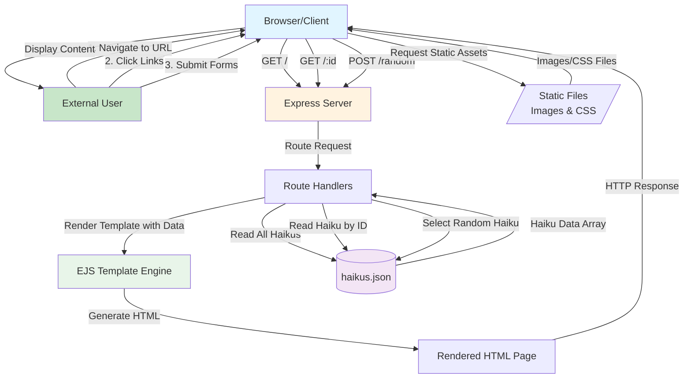
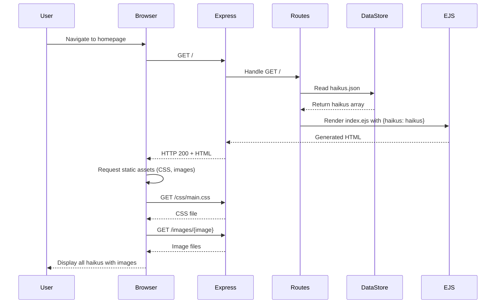
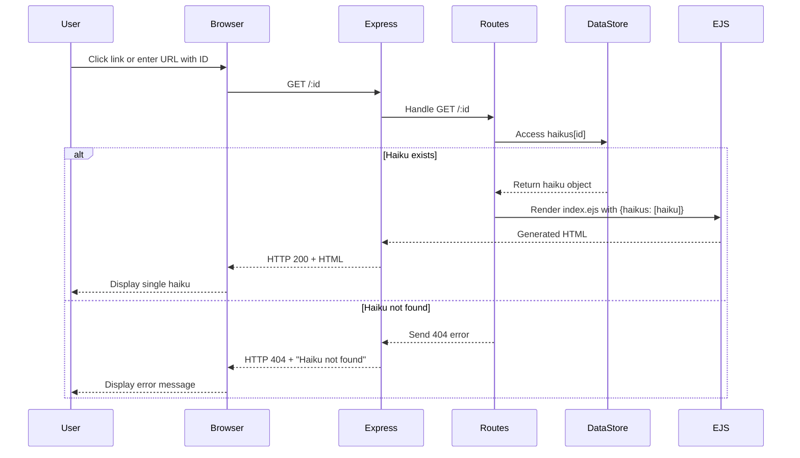
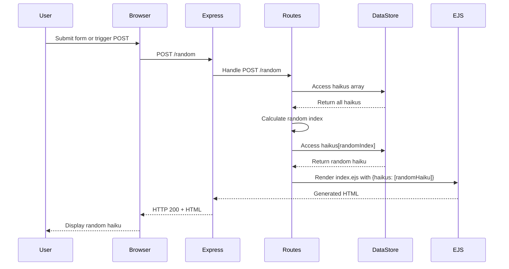
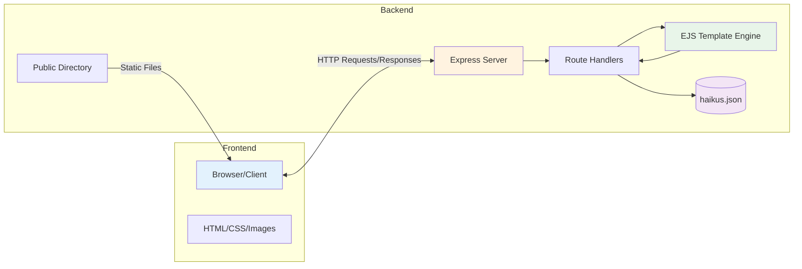

# Data Flow Diagram

This diagram shows the data flows between the Frontend (Browser/Client) and Backend (Express Server) in the Haikus for June application.

## High-Level System Overview

## Detailed Data Flow Sequences

### Sequence 1: Load All Haikus (GET /)

### Sequence 2: Load Single Haiku by ID (GET /:id)

### Sequence 3: Get Random Haiku (POST /random)

## Component Architecture

