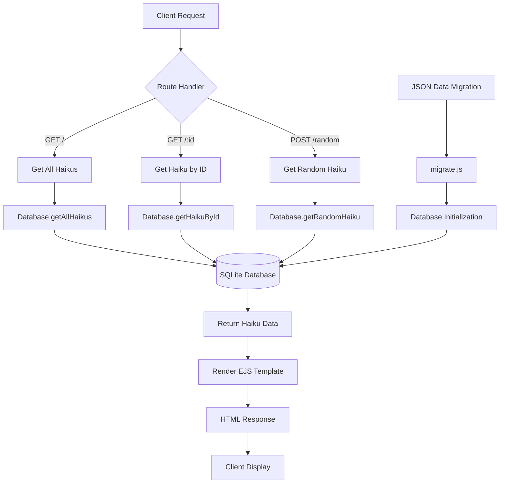

# Haikus for June

This is a quick node project for demoing Workspaces and deployment to Azure App Service using Actions. It is based off of the [Azure node sample](https://github.com/Azure-Samples/nodejs-docs-hello-world). It's great!!!

## Setup

1. Install dependencies:
   ```bash
   npm install
   ```

2. Run the database migration to set up SQLite and migrate data:
   ```bash
   npm run migrate
   ```

3. Start the application:
   ```bash
   npm start
   ```

   Or for development with auto-restart:
   ```bash
   npm run dev
   ```

## Database

The application uses SQLite to store haiku data. The database schema includes:

- **haikus table**: Stores haiku text, associated image filename, and timestamps
- Auto-incrementing primary key for unique haiku IDs
- Created timestamp for each haiku entry

## API Endpoints

- `GET /` - Display all haikus
- `GET /:id` - Display a specific haiku by ID (1-based)
- `POST /random` - Display a random haiku

## Testing

Run the test suite:
```bash
npm test
```

Run tests in watch mode:
```bash
npm run testwatch
```

Generate coverage report:
```bash
npm run coverage
```

## Data Flow Diagram




