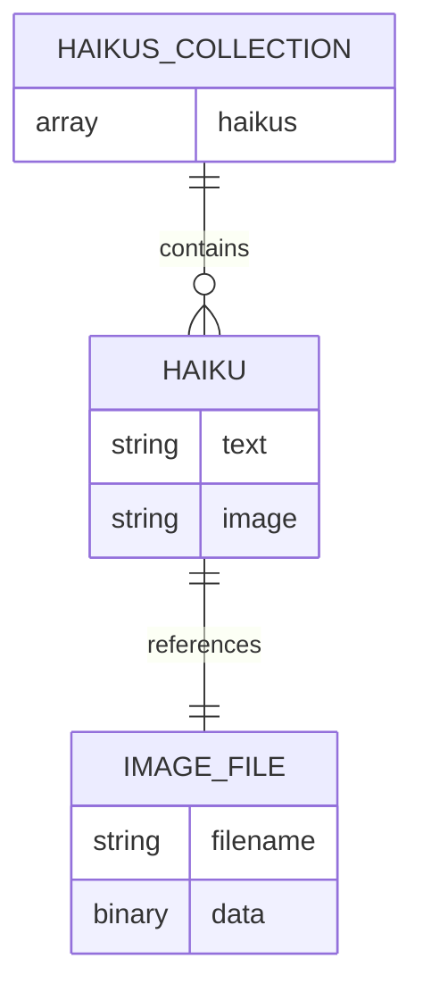
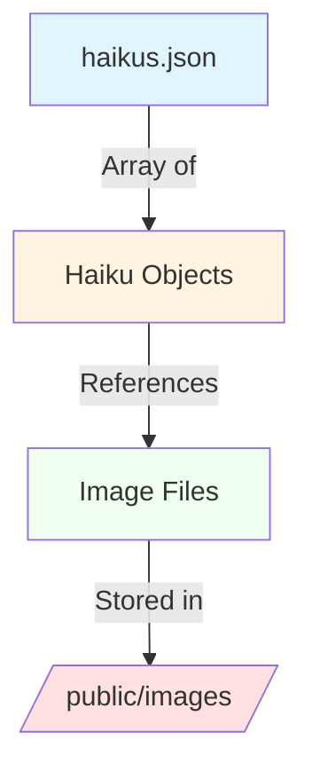

# Datastructures

**Description:** This document outlines the data types, properties, and relationships used in the Haikus for June application.

## Overview

The application uses a simple JSON-based data model to store and serve haikus. There is no database backend; all data is stored in a static JSON file.

## Data Types

### Haiku

The core data structure representing a single haiku about June the rescue dog.

**Properties:**
- `text` (string): The haiku content, typically formatted with line breaks (\n)
- `image` (string): The filename of the associated image (stored in `/public/images/`)

**Example:**
```json
{
  "text": "Pulling on my leash,\nTo meet my newest best friend,\nEvery single dog... :-)",
  "image": "adopted.jpg"
}
```

### Haikus Collection

An array of Haiku objects stored in `haikus.json`.

**Structure:**
```json
[
  {
    "text": "...",
    "image": "..."
  },
  {
    "text": "...",
    "image": "..."
  }
]
```

## Entity Relationship Diagram



## File System Structure



## Data Storage

- **Location:** `/haikus.json`
- **Format:** JSON array
- **Persistence:** Static file (no runtime modifications)
- **Current Count:** 6 haikus

## Data Flow

1. Application startup: `haikus.json` is loaded into memory
2. Request received: Server accesses haikus array by index or serves all
3. Response rendered: EJS template receives haiku data and renders HTML with images

## No Database

This application intentionally uses a simple file-based approach:
- No ORM required
- No database connection
- Data is read-only at runtime
- Updates require file modification and redeployment
