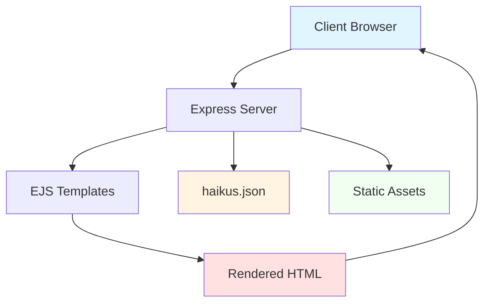

# Haikus for June - Documentation

Welcome to the comprehensive documentation for the Haikus for June project. This documentation provides detailed information about the application's architecture, API, data structures, and user experiences.

## Project Overview

Haikus for June is a Node.js/Express web application that serves haikus about June, a rescue dog. The application features server-side rendering with EJS templates, static JSON-based data storage, and is designed for deployment to Azure App Service.

## Documentation Structure

### Technical Documentation

1. **[Datastructures.md](./Datastructures.md)**
   - Data types and properties
   - Entity relationship diagrams
   - File system structure
   - Data storage approach

2. **[Sequence-Diagram.md](./Sequence-Diagram.md)**
   - Request/response flows
   - Application startup sequence
   - Data flow architecture
   - Static asset serving

3. **[API-Endpoints.md](./API-Endpoints.md)**
   - Complete API reference
   - Endpoint specifications
   - Sample requests and responses
   - Testing examples

### User Journey Documentation

Located in the `user-journey/` subfolder, these documents describe different user personas and their interactions with the application:

4. **[Casual Visitor](./user-journey/casual-visitor.md)**
   - Persona: Sarah Martinez, dog lover seeking entertainment
   - Journey: Discovery through social media to content sharing
   - Focus: Quick consumption and social sharing

5. **[Developer](./user-journey/developer.md)**
   - Persona: Alex Chen, full-stack developer
   - Journey: Code exploration to potential contribution
   - Focus: Understanding architecture and learning

6. **[Content Maintainer](./user-journey/content-maintainer.md)**
   - Persona: Jordan, June's owner
   - Journey: Content creation to deployment
   - Focus: Adding haikus and maintaining the site

7. **[Mobile Social Media User](./user-journey/mobile-social-media-user.md)**
   - Persona: Marcus Thompson, mobile-first social media user
   - Journey: Social discovery to viral sharing
   - Focus: Mobile experience and content amplification

## Quick Start

### For Developers

```bash
# Clone the repository
git clone https://github.com/peckjon/haikus-for-june.git
cd haikus-for-june

# Install dependencies
npm install

# Run tests
npm test

# Start the server
npm start

# Visit in browser
open http://localhost:3000
```

### For Content Maintainers

1. Add images to `/raw_images/` (JPEG/PNG format, descriptive names like `june-park.jpg`)
2. Run `gulp` to optimize images (outputs to `/public/images/`)
3. Update `haikus.json` with new entries (text and image filename)
4. Test locally with `npm start`
5. Commit and push changes to deploy

## Technology Stack

- **Runtime:** Node.js
- **Framework:** Express.js
- **Templating:** EJS (Embedded JavaScript)
- **Testing:** Jest with Supertest
- **Build Tools:** Gulp (image optimization)
- **Deployment:** Azure App Service via GitHub Actions

## Key Features

- 📝 Server-side rendered haikus with images
- 🎲 Random haiku endpoint
- 🔗 Direct linking to individual haikus
- 📱 Mobile-responsive design
- 🚀 Automated deployment via CI/CD
- ✅ Test coverage for core functionality

## Architecture Highlights



## API Endpoints Summary

| Endpoint | Method | Description |
|----------|--------|-------------|
| `/` | GET | View all haikus |
| `/:id` | GET | View specific haiku by index |
| `/random` | POST | Get a random haiku |
| `/images/*` | GET | Serve static images |
| `/css/*` | GET | Serve CSS files |

## Data Model

The application uses a simple JSON array structure:

```json
[
  {
    "text": "Haiku text with\nLine breaks for proper\nFormatting here",
    "image": "filename.jpg"
  }
]
```

## Contributing

Interested in contributing? Check out the [Developer user journey](./user-journey/developer.md) to understand the development workflow.

## Deployment

The application automatically deploys to Azure App Service when changes are pushed to the main branch via GitHub Actions.

## Support

For questions or issues, please refer to the relevant documentation section:
- Technical questions → See API and architecture docs
- Content updates → See Content Maintainer journey
- User experience → See relevant user journey docs

## Documentation Maintenance

This documentation was created to provide comprehensive coverage of the application from multiple perspectives. When updating the application:

- Update technical docs if APIs or data structures change
- Update user journeys if workflows or features change
- Keep code examples in sync with actual implementation
- Test all documented endpoints after changes

---

**Last Updated:** 2025-10-28

**Documentation Version:** 1.0.0
