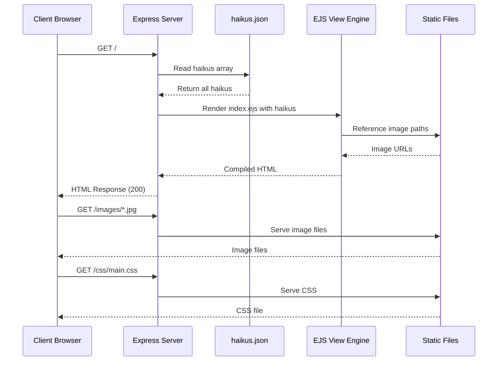
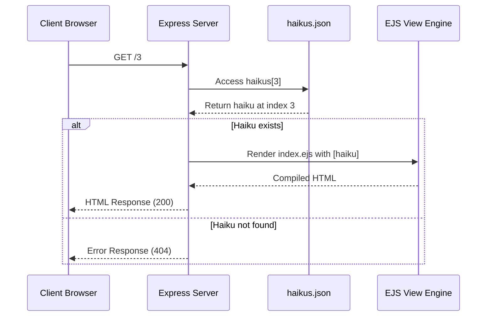
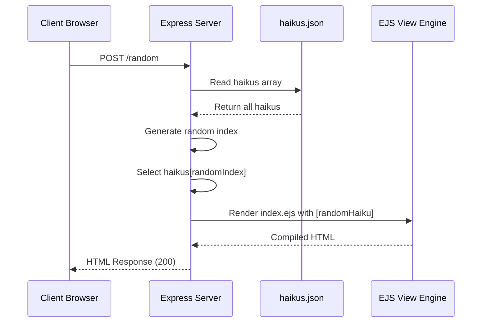
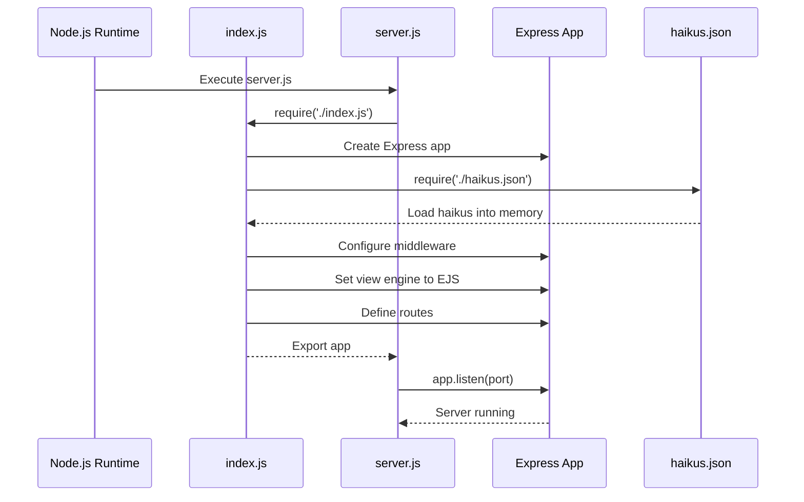
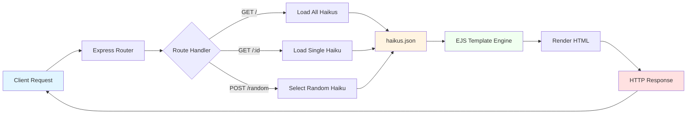
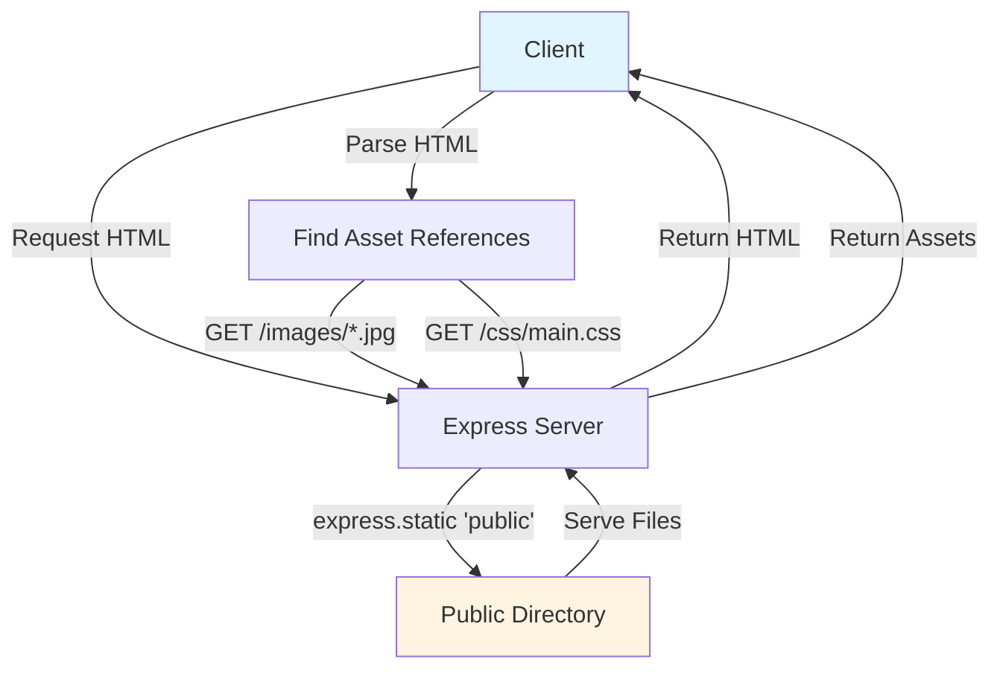

# Sequence Diagram

**Description:** This document illustrates the dataflows between the datastore (JSON file), application logic, and frontend rendering in the Haikus for June application.

## Overview

The application follows a simple request-response pattern with server-side rendering using EJS templates. There is no traditional ORM as data is served directly from a JSON file.

## System Components

- **Client Browser**: User's web browser
- **Express Server**: Node.js web server handling HTTP requests
- **JSON Datastore**: `haikus.json` file containing haiku data
- **EJS View Engine**: Template renderer for HTML generation
- **Static Assets**: Images and CSS served from `/public/`

## Request Flow Diagram

### GET / (View All Haikus)

### GET /:id (View Single Haiku)

### POST /random (Random Haiku)

## Application Startup Flow

## Data Flow Architecture

## Static Asset Flow

## Key Points

- **No ORM**: Application directly accesses JSON data without an ORM layer
- **In-Memory**: `haikus.json` is loaded once at startup and kept in memory
- **Read-Only**: No write operations to the datastore during runtime
- **Server-Side Rendering**: All HTML is generated server-side using EJS
- **Static Assets**: Images and CSS are served via Express static middleware
