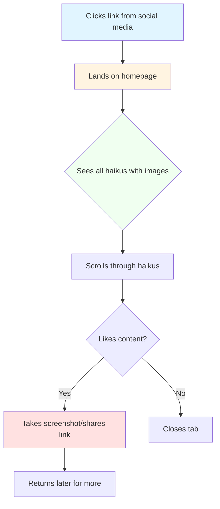

# User Journey: Casual Visitor

## Persona

**Name:** Sarah Martinez

**Age:** 32

**Background:** Dog lover and casual internet user who enjoys wholesome content

**Tech Savvy:** Moderate - comfortable with basic web browsing

**Goals:**
- Find entertaining and heartwarming content about dogs
- Quick distraction during work breaks
- Share cute dog content with friends

**Device:** Mobile phone (70% of time), laptop (30%)

## User Story

As a casual visitor, Sarah wants to browse cute haikus about a rescue dog to brighten her day and potentially share them with friends.

## Scenario

Sarah is taking a quick break from work and wants to see something wholesome and uplifting. A friend shared a link to "Haikus for June" on social media.

## Journey Flow

## Detailed Steps

### 1. Discovery
**Action:** Sarah clicks a shared link from Twitter/Facebook  
**Endpoint Used:** `GET /`  
**What Happens:** Homepage loads with all 6 haikus and June's photos  
**User Experience:** Immediately sees cute dog photos with funny haikus  
**Emotion:** Curious, intrigued

### 2. Browse Content
**Action:** Scrolls through the page viewing each haiku  
**Endpoint Used:** N/A (static page)  
**What Happens:** Reads haikus, looks at photos  
**User Experience:** Finds relatable and humorous dog content  
**Emotion:** Amused, delighted

### 3. Favorite Discovery
**Action:** Finds a particularly funny haiku  
**Endpoint Used:** N/A (viewing)  
**What Happens:** Reads "Fridge is opening, Silly humans look away, Lunchables bandit!!?"  
**User Experience:** Laughs out loud  
**Emotion:** Joy, connection

### 4. Share with Friends
**Action:** Takes screenshot or copies URL  
**Endpoint Used:** N/A (browser functionality)  
**What Happens:** Prepares to share content on social media or text  
**User Experience:** Wants to spread joy to others  
**Emotion:** Generous, enthusiastic

### 5. Return Visit (Optional)
**Action:** Bookmarks or remembers site  
**Endpoint Used:** `GET /`  
**What Happens:** Returns when needing a mood boost  
**User Experience:** Quick access to familiar, comforting content  
**Emotion:** Satisfied, content

## Pain Points

- **Mobile responsiveness:** Needs to be optimized for phone viewing
- **Loading speed:** Images should load quickly for short breaks
- **No sharing buttons:** Would appreciate built-in social sharing

## Success Metrics

- ✅ User spends 30+ seconds on site
- ✅ User shares link with at least one person
- ✅ User returns within a week
- ✅ All images load within 3 seconds

## Touchpoints

1. **Social Media Link** → Homepage
2. **Homepage** → Content Consumption
3. **Content** → Emotional Response
4. **Emotional Response** → Sharing Action
5. **Sharing** → New User Acquisition

## User Quotes (Hypothetical)

> "This is exactly what I needed today! June is adorable!"

> "The haikus are so relatable - my dog does the same things!"

> "Sending this to my whole family, they'll love it!"

## Design Considerations

- Large, clear images that load quickly
- Readable text on mobile devices
- Simple, uncluttered layout
- Warm, friendly color scheme
- Easy navigation (even though it's one page)
