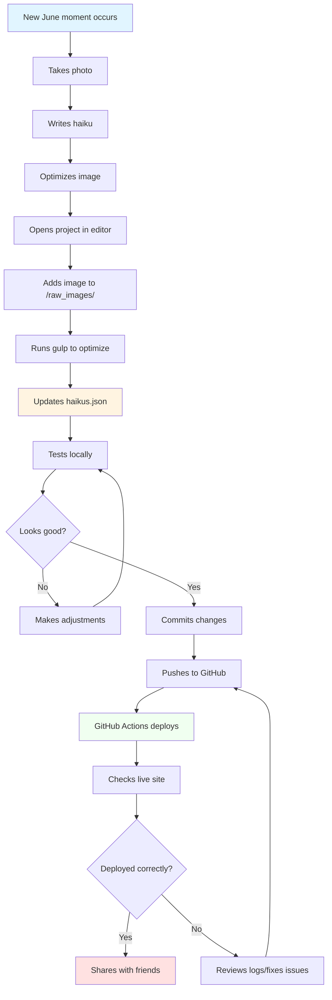
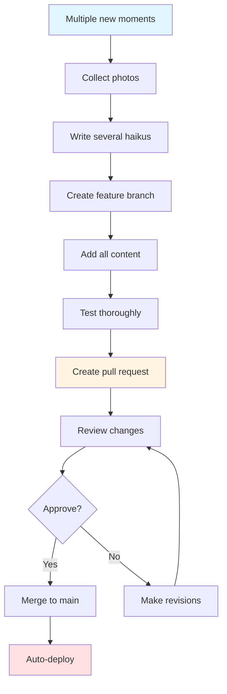

# User Journey: Content Creator/Maintainer

## Persona

**Name:** Jordan (June's Human)

**Age:** 35

**Background:** June's owner who wants to share their rescue dog's personality with the world

**Tech Savvy:** Moderate - can use Git basics, edit files, and deploy applications

**Goals:**
- Add new haikus about June's adventures
- Update images as June grows
- Maintain the site as a digital scrapbook
- Share June's story with family and friends

**Device:** Laptop for content management, mobile to check the live site

## User Story

As June's owner and content maintainer, Jordan wants to regularly update the haikus and images to document June's life and share new stories with visitors.

## Scenario

Jordan has captured new photos of June and written fresh haikus based on recent funny moments. They want to add this content to the website and deploy the updates.

## Journey Flow



## Detailed Steps

### 1. Content Inspiration
**Action:** June does something adorable/funny  
**Tool Used:** Smartphone camera  
**What Happens:** Captures the moment in a photo  
**User Experience:** Real-life event triggers content creation  
**Emotion:** Amused, inspired, loving

### 2. Creative Writing
**Action:** Writes haiku about the moment  
**Tool Used:** Notes app or text editor  
**What Happens:** Crafts 5-7-5 syllable format haiku  
**Example:**
```
Running through the park,
Squirrel watching intensifies,
Nature documentary!
```
**User Experience:** Creative expression  
**Emotion:** Playful, creative, proud

### 3. Image Preparation
**Action:** Selects and prepares photo  
**Tool Used:** Photo editing app or Gulp  
**What Happens:** Optimizes image size and quality  
**Process:**
```bash
# Place in raw_images directory
cp ~/photos/june-park.jpg ./raw_images/
# Run gulp to optimize
gulp
```
**User Experience:** Technical but automated  
**Emotion:** Methodical, careful

### 4. Data Update
**Action:** Opens haikus.json in editor  
**Tool Used:** VS Code, Sublime Text, or any text editor  
**What Happens:** Adds new entry to array  
**Code Change:**
```json
{
  "text": "Running through the park,\nSquirrel watching intensifies,\nNature documentary!",
  "image": "june-park.jpg"
}
```
**User Experience:** Simple JSON editing  
**Emotion:** Focused, precise

### 5. Local Testing
**Action:** Runs application locally  
**Commands Used:**
```bash
npm start
# or
npm run dev  # for auto-reload during development
```
**What Happens:** Views changes at localhost:3000  
**User Experience:** Immediate visual feedback  
**Emotion:** Anticipating, checking quality

### 6. Quality Check
**Action:** Reviews new haiku on local site  
**Checks:**
- ✓ Image displays correctly
- ✓ Text formatting is proper
- ✓ No typos in haiku
- ✓ Image loads quickly
- ✓ Mobile view looks good
**User Experience:** Quality assurance  
**Emotion:** Critical, detail-oriented

### 7. Run Tests
**Action:** Ensures no code issues  
**Command Used:** `npm test`  
**What Happens:** Jest validates application still works  
**User Experience:** Confidence in changes  
**Emotion:** Reassured, professional

### 8. Version Control
**Action:** Commits and pushes changes  
**Commands Used:**
```bash
git add haikus.json public/images/june-park.jpg
git commit -m "Add new haiku about park adventure"
git push origin main
```
**User Experience:** Saving work permanently  
**Emotion:** Accomplished, organized

### 9. Deployment
**Action:** GitHub Actions automatically deploys  
**Tool Used:** GitHub Actions → Azure App Service  
**What Happens:** CI/CD pipeline builds and deploys  
**User Experience:** Automated deployment process  
**Emotion:** Waiting, anticipating

### 10. Verification
**Action:** Checks live production site  
**Tool Used:** Web browser  
**What Happens:** Sees new haiku live on the internet  
**User Experience:** Validation of entire process  
**Emotion:** Satisfied, excited

### 11. Sharing
**Action:** Announces update on social media  
**Tool Used:** Twitter, Instagram, Facebook  
**What Happens:** Followers see new June content  
**User Experience:** Community engagement  
**Emotion:** Proud, connected, joyful

## Alternative Path: Bulk Update



## Pain Points

- **Image optimization:** Manual gulp process could be automated in CI
- **No preview environment:** Would benefit from staging deployment
- **JSON editing:** Could use a CMS or admin interface for non-technical users
- **No content scheduling:** Can't prepare content to publish later

## Success Metrics

- ✅ Adds new haiku successfully within 15 minutes
- ✅ Zero deployment errors
- ✅ All existing haikus still display correctly
- ✅ Tests pass before and after changes
- ✅ New content shared with audience

## Touchpoints

1. **Real Life** → Content Inspiration
2. **File System** → Content Addition
3. **Local Development** → Quality Check
4. **Git** → Version Control
5. **GitHub Actions** → Automated Deployment
6. **Production Site** → Final Verification
7. **Social Media** → Audience Sharing

## Maintainer Quotes (Hypothetical)

> "It's so easy to add new haikus - just edit the JSON and push!"

> "I love seeing June's personality preserved in this digital scrapbook."

> "The automated deployment makes updates painless."

> "Wish there was a way to schedule haikus for future release."

## Content Guidelines

When adding new haikus, maintain:
- **Consistency:** 5-7-5 syllable format
- **Tone:** Lighthearted, from June's perspective
- **Image Quality:** Clear, well-lit photos of June
- **File Size:** Optimized images under 500KB
- **Relatability:** Situations other dog owners recognize

## Technical Requirements

- Access to GitHub repository (write permissions)
- Node.js and npm installed locally
- Understanding of JSON syntax
- Basic Git knowledge
- Image editing capability
