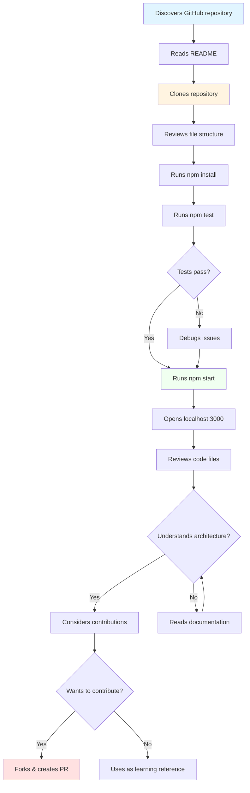

# User Journey: Developer Exploring the Codebase

## Persona

**Name:** Alex Chen

**Age:** 28

**Background:** Full-stack developer interested in learning and contributing to open source

**Tech Savvy:** High - experienced with Node.js, Express, and modern web development

**Goals:**
- Understand the application architecture
- Learn from code examples
- Possibly contribute improvements
- Use as a template for similar projects

**Device:** Laptop/desktop with development tools

## User Story

As a developer, Alex wants to explore the haikus-for-june codebase to understand its structure, learn from its implementation, and potentially contribute improvements or use it as a reference for their own projects.

## Scenario

Alex discovered the repository on GitHub while looking for simple Node.js/Express examples for deployment to Azure App Service. They want to understand how it works and potentially use it as a learning resource.

## Journey Flow



## Detailed Steps

### 1. Repository Discovery
**Action:** Finds repo via GitHub search or recommendations  
**Tool Used:** GitHub web interface  
**What Happens:** Reads repository title, description, and stars  
**User Experience:** Determines if project is relevant  
**Emotion:** Curious, evaluating

### 2. Initial Assessment
**Action:** Reviews README and file structure  
**Tool Used:** GitHub file browser  
**What Happens:** Understands project purpose and tech stack  
**User Experience:** Quick overview of project scope  
**Emotion:** Interested, engaged

### 3. Local Setup
**Action:** Clones repository and installs dependencies  
**Commands Used:**
```bash
git clone https://github.com/peckjon/haikus-for-june.git
cd haikus-for-june
npm install
```
**What Happens:** Downloads code and dependencies  
**User Experience:** Standard development setup  
**Emotion:** Anticipating, focused

### 4. Code Validation
**Action:** Runs test suite  
**Command Used:** `npm test`  
**What Happens:** Jest runs 3 test cases  
**User Experience:** Confirms code quality and functionality  
**Emotion:** Confident, reassured

### 5. Application Launch
**Action:** Starts development server  
**Command Used:** `npm start` or `npm run dev`  
**What Happens:** Express server starts on port 3000  
**User Experience:** Sees application running live  
**Emotion:** Satisfied, exploratory

### 6. Code Exploration
**Action:** Opens and reviews key files  
**Files Reviewed:**
- `index.js` - Main application logic
- `server.js` - Server entry point
- `haikus.json` - Data structure
- `views/index.ejs` - Template
- `index.test.js` - Test cases
**What Happens:** Understands code organization and patterns  
**User Experience:** Learning implementation details  
**Emotion:** Analytical, learning

### 7. API Testing
**Action:** Tests endpoints manually  
**Tools Used:** cURL, Postman, or browser  
**Commands:**
```bash
curl http://localhost:3000/
curl http://localhost:3000/0
curl -X POST http://localhost:3000/random
```
**What Happens:** Verifies endpoint behavior  
**User Experience:** Hands-on understanding of API  
**Emotion:** Experimental, validating

### 8. Documentation Review
**Action:** Reads newly created documentation  
**Files Read:**
- `docs/Datastructures.md`
- `docs/Sequence-Diagram.md`
- `docs/API-Endpoints.md`
**What Happens:** Gains comprehensive understanding  
**User Experience:** Clear, structured information  
**Emotion:** Enlightened, appreciative

### 9. Contribution Consideration
**Action:** Identifies potential improvements  
**Possibilities:**
- Add more test coverage
- Improve mobile responsiveness
- Add API documentation
- Implement caching
**What Happens:** Evaluates contribution opportunities  
**User Experience:** Thinking about how to add value  
**Emotion:** Creative, motivated

### 10. Fork and Contribute (Optional)
**Action:** Creates fork and submits pull request  
**Tool Used:** GitHub  
**What Happens:** Contributes improvement back to project  
**User Experience:** Participates in open source  
**Emotion:** Accomplished, collaborative

## Pain Points

- **Limited documentation (before this PR):** Needs comprehensive docs to understand quickly
- **No contribution guidelines:** Would benefit from CONTRIBUTING.md
- **Minimal comments in code:** Some complex logic could use inline documentation
- **No CI/CD visible:** Would like to see GitHub Actions workflows

## Success Metrics

- ✅ Successfully runs application locally within 10 minutes
- ✅ Understands core functionality within 30 minutes
- ✅ Can modify code and see changes
- ✅ All tests pass
- ✅ Feels confident to make contributions

## Touchpoints

1. **GitHub Repository** → Code Discovery
2. **README** → Project Understanding
3. **Local Development** → Hands-on Experience
4. **Documentation** → Deep Comprehension
5. **Tests** → Quality Validation
6. **Pull Request** → Contribution

## Developer Quotes (Hypothetical)

> "Great example of a simple Express app with clean structure!"

> "Perfect reference for deploying Node.js to Azure App Service."

> "The test suite gave me confidence in the codebase quality."

> "Would love to see more documentation about the architecture."

## Technical Considerations

- **Clear file organization:** Easy to navigate
- **Standard conventions:** Follows Express best practices
- **Test coverage:** Good starting point but could be expanded
- **Dependency management:** Uses package.json appropriately
- **Documentation:** Now comprehensive with this PR!
