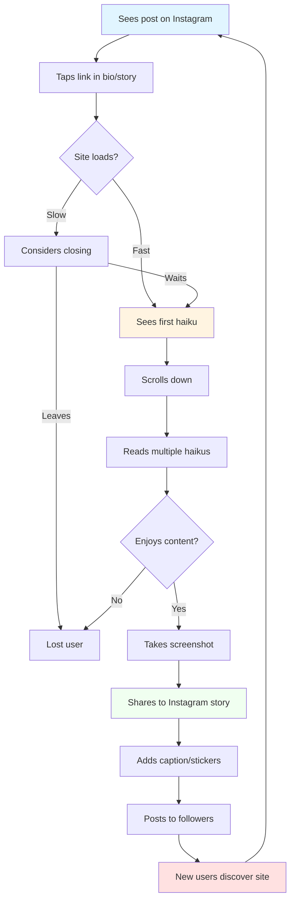
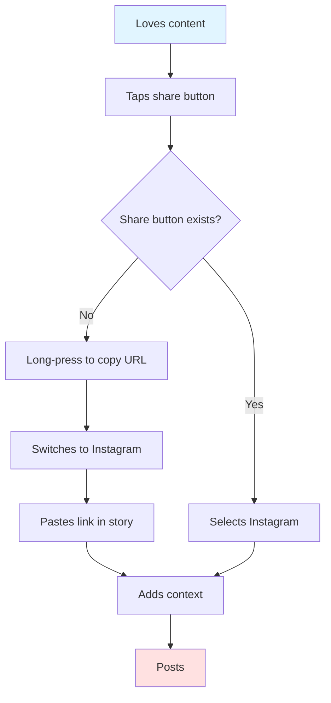

# User Journey: Mobile User on Social Media

## Persona

**Name:** Marcus Thompson

**Age:** 24

**Background:** Active social media user who loves sharing and discovering viral content

**Tech Savvy:** Moderate - very comfortable with mobile apps, less with traditional websites

**Goals:**
- Quick entertainment during commute
- Find shareable content for Instagram stories
- Engage with dog-related content
- Pass time while waiting in lines

**Device:** iPhone (primary), occasional tablet use

## User Story

As a mobile-first social media user, Marcus wants to quickly view and share dog haikus while scrolling through social feeds during his daily commute.

## Scenario

Marcus is on the subway heading home from work, scrolling through Instagram when he sees a friend share a link to "Haikus for June" with the caption "This made my day! 🐕❤️"

## Journey Flow

## Detailed Steps

### 1. Social Discovery
**Action:** Sees post while scrolling Instagram feed  
**Platform:** Instagram mobile app  
**What Happens:** Friend's post appears in feed with preview  
**Content:** "OMG these dog haikus are EVERYTHING 🐕💕"  
**User Experience:** Curiosity piqued by endorsement  
**Emotion:** Curious, interested

### 2. Link Navigation
**Action:** Taps on link in bio or "Link in story" sticker  
**Platform:** Instagram → External browser  
**What Happens:** Instagram opens in-app browser or Safari  
**Transition:** App switch feels seamless  
**User Experience:** Brief loading moment  
**Emotion:** Anticipating, slightly impatient

### 3. First Impression (Critical Moment)
**Action:** Site loads on mobile screen  
**Endpoint Used:** `GET /`  
**What Happens:** Homepage renders, images start loading  
**Timing:** Must be under 3 seconds or risk losing user  
**User Experience:** Immediate visual assessment  
**Emotion:** Evaluating whether to stay or leave

### 4. Content Consumption
**Action:** Scrolls through haikus vertically  
**Platform:** Mobile browser (portrait orientation)  
**What Happens:** Views images and reads text for each haiku  
**Interaction:** Simple thumb scrolling  
**User Experience:** Smooth, effortless browsing  
**Emotion:** Engaged, amused

### 5. Emotional Connection
**Action:** Reads particularly relatable haiku  
**Example:** "Fridge is opening, Silly humans look away, Lunchables bandit!!?"  
**What Happens:** Recognizes own pet's behavior  
**Internal Response:** "OMG my dog does this too! 😂"  
**User Experience:** Personal connection to content  
**Emotion:** Delighted, validated, amused

### 6. Screenshot Decision
**Action:** Decides to capture content  
**Tool Used:** iPhone screenshot (volume + power button)  
**What Happens:** Saves image of favorite haiku  
**Purpose:** To share with followers  
**User Experience:** Quick, native mobile action  
**Emotion:** Excited to share

### 7. Platform Return
**Action:** Switches back to Instagram app  
**Platform:** Browser → Instagram  
**What Happens:** Returns to create story  
**Navigation:** App switcher or back button  
**User Experience:** Familiar mobile multitasking  
**Emotion:** Creative, eager

### 8. Content Creation
**Action:** Creates Instagram story with screenshot  
**Tools Used:**
- Instagram story editor
- Text tools
- Stickers (emoji, GIFs)
- Tags/mentions
**What Happens:** Personalizes share with commentary  
**Example:** Screenshot + "RELATE 💯" text + dog emoji  
**User Experience:** Creative expression  
**Emotion:** Playful, generous

### 9. Story Publishing
**Action:** Posts to Instagram story  
**Platform:** Instagram  
**What Happens:** Story goes live to followers (500+ people)  
**Reach:** Potential for significant traffic back to site  
**User Experience:** Sharing joy with community  
**Emotion:** Satisfied, influential

### 10. Viral Loop
**Action:** Followers see story and click through  
**What Happens:** New users visit site, cycle repeats  
**Result:** Exponential reach through social sharing  
**User Experience:** Content discovery network effect  
**Emotion:** Connected to trend

## Alternative Path: Direct Share

## Pain Points

- **Loading speed on mobile data:** Images must be optimized
- **No native share buttons:** Makes sharing harder than it should be
- **Portrait orientation only:** No landscape optimization
- **Text size:** Must be readable without zooming
- **No save/bookmark feature:** Can't easily return later
- **Accidental touches:** Small tap targets can frustrate

## Success Metrics

- ✅ Site loads in under 3 seconds on 4G
- ✅ User spends 45+ seconds on site
- ✅ User shares content to at least one social platform
- ✅ Zero crashes or errors on mobile
- ✅ Content readable without zoom

## Mobile-Specific Considerations

### Screen Sizes
- iPhone SE: 375x667px
- iPhone 12/13: 390x844px
- iPhone Pro Max: 428x926px
- Android variety: 360-420px width

### Network Conditions
- 4G LTE: 5-12 Mbps
- 5G: 50-100+ Mbps
- Subway/train: Intermittent connectivity
- Coffee shop WiFi: Variable quality

### User Behavior Patterns
- **Thumb zone:** Bottom 70% of screen easily reachable
- **Scroll direction:** Vertical, continuous
- **Attention span:** 5-15 seconds per item
- **Multi-tasking:** Frequent app switching

## Touchpoints

1. **Social Media** → Discovery
2. **Mobile Browser** → First Impression
3. **Content** → Emotional Response
4. **Screenshot** → Capture
5. **Story Creation** → Personalization
6. **Publishing** → Amplification
7. **Network Effect** → Growth

## Mobile User Quotes (Hypothetical)

> "This loaded so fast! Usually sites from Instagram take forever."

> "Perfect bite-sized content for my commute."

> "Just screenshot and share - so easy!"

> "Why isn't there a share button though?"

> "My friends are going to love this!"

## Design Priorities for Mobile

1. **Speed:** Fast loading images
2. **Readability:** Large, legible text
3. **Simplicity:** Minimal navigation needed
4. **Visual appeal:** High-quality, optimized images
5. **Shareability:** Easy content capture and sharing
6. **Responsive:** Works on all screen sizes

## Technical Requirements

- Responsive CSS with mobile-first approach
- Optimized image sizes (WebP with JPEG fallback)
- Lazy loading for images
- Viewport meta tags properly configured
- Touch-friendly tap targets (44x44px minimum)
- Fast server response times
